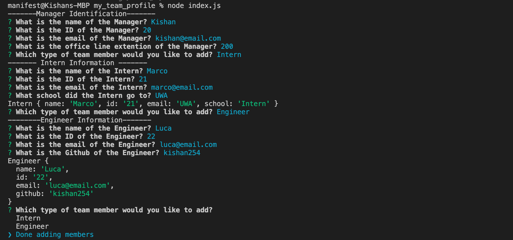
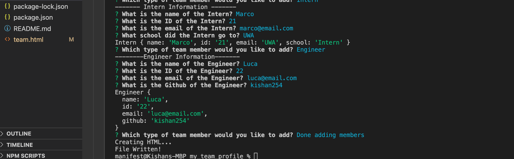
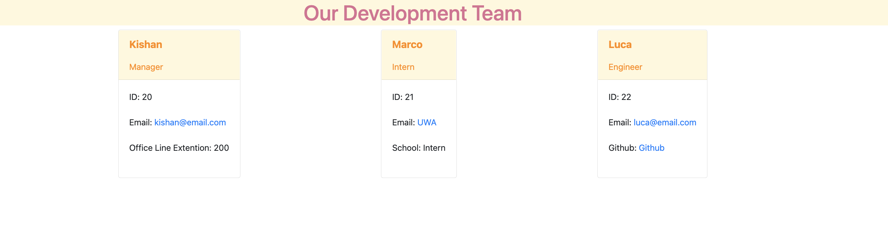
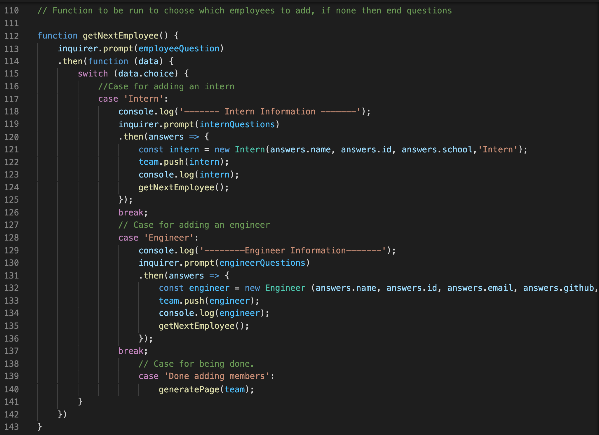
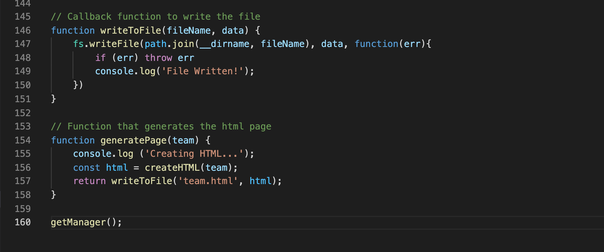
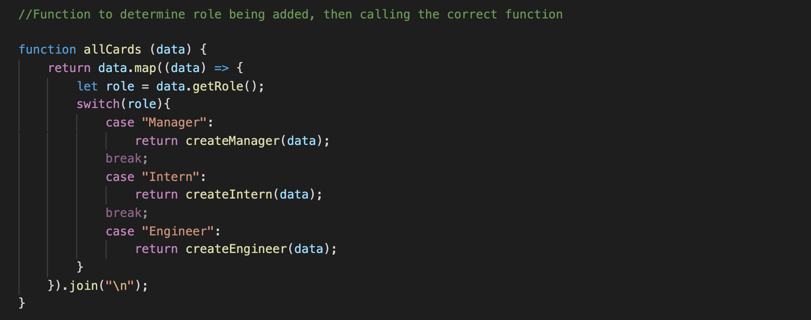
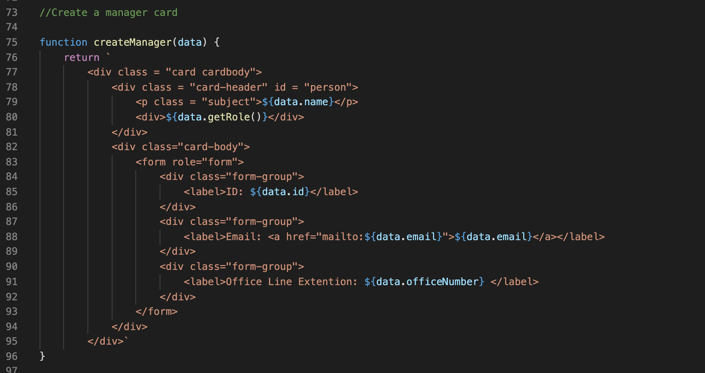

# my_team_profile
This is a app created using Node.js in which the system generates team member's cards that can be viewed in html file

## Description

This is an app I created using the node.js framework in which the user is able to add profiles to their portfolio and have a record of all the employees' details

This was a bootcamp project which I really enjoyed working on

## Tabel of Contents

* [Installation](#installation)
* [Usage](#usage)
* [Contribute](#contribute)
* [Tests](#tests)
* [Screenshots](#screenshots)
* [Technology](#technology)
* [Making](#making)
* [Questions](#questions)

## Installation

In order to run this application, you will need to install the following

- npm install jest
- npm instal inquirer

## Usage

In order to use this app, you will need to understand the following;

- HTML
- Node
- Javascript

## Contribute

In order to contribute to this app, you will need to understand the following;

- HTML
- Node
- Javascript

## Tests

To run tests, please use the following command:

- npm run test

## Screenshots 

## Technology

- Github
- HTML
- CSS - Bootstrap
- Javascript
- Node.js

## Making

These are the screenshots of the code 

Get Employee Function

Generate the page function

Card Selector function 

Card Generator 

## Questions

Please click the links below

[Github] (https://github.com/kishan254)

Write me on;

[Email] (kishan.gosrani@hotmail.com)

## License

This project is currently licensed under the MIT [License](https://choosealicense.com/licenses/mit/)